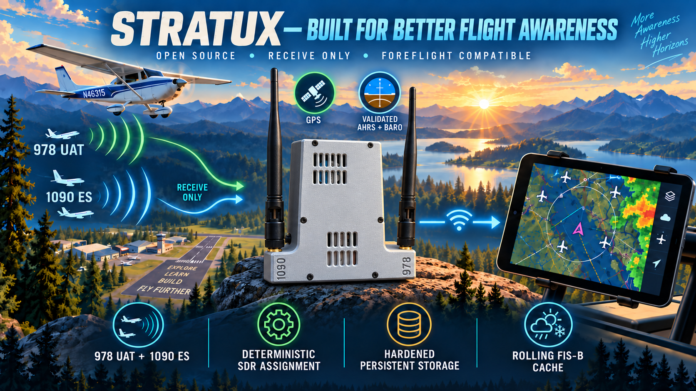

<p align="center">
  
</p>

[](https://github.com/ddavis83864/stratux/actions/workflows/ci.yml)
[](https://discord.gg/D9NQ6xe4nF)

# Stratux &#9992;

Stratux turns a Raspberry Pi and one or more RTL-SDR USB dongles into a portable, dual-band
(1090 MHz ADS-B / 978 MHz UAT) aviation receiver. It fuses traffic, FIS-B weather, GPS, and
AHRS data and broadcasts it over Wi-Fi as GDL90 (plus several other formats) to Electronic
Flight Bag apps such as ForeFlight, as well as compatible EFIS/EFB tools that speak
FLARM/NMEA, X-Plane, or Cursor-on-Target.

**This repository (`ddavis83864/stratux`) is a maintained, actively developed fork of
[`stratux/stratux`](https://github.com/stratux/stratux)**, the community project that
originally combined the US and EU editions of Stratux. This fork's focus is operational
trustworthiness: knowing whether each subsystem is actually healthy, whether a preflight
check passed, whether a recording captured what you think it did, and being conservative
about ever deleting your data — on top of the same core receiver Stratux has always been.
See [Fork enhancements](#fork-enhancements) for what is specifically new here.

> **Experimental / Non-Certified Aviation System:** This project provides supplemental
> situational-awareness information only. It is not intended to replace required or approved
> aircraft instruments, certified navigation equipment, official aviation information, or the
> pilot's responsibility to maintain situational awareness and see and avoid traffic. See
> [Safety, Certification, and Operational Disclaimer](#safety-certification-and-operational-disclaimer)
> at the end of this README.

**Is this fork for you?** If you already run Stratux and want richer health/readiness
reporting, optional automatic flight recording, traffic/system alerting, configuration
backup, or power-loss resilience — without giving up anything the original does — this fork
adds those on top. If you just want the well-established, widely deployed baseline
experience, the upstream [`stratux/stratux`](https://github.com/stratux/stratux) project and
its [wiki](https://github.com/stratux/stratux/wiki) remain the right starting point. Either
way, read [Installation and getting started](#installation-and-getting-started) below before
you build anything — **this fork does not currently publish a ready-made image or package
of its own** (see that section for why, and the verified build path).

## Table of contents

- [Fork enhancements](#fork-enhancements)
- [Core capabilities](#core-capabilities)
- [Supported and validated configurations](#supported-and-validated-configurations)
- [Installation and getting started](#installation-and-getting-started)
- [Using the system](#using-the-system)
- [Documentation index](#documentation-index)
- [Upstream relationship and attribution](#upstream-relationship-and-attribution)
- [Contributing and support](#contributing-and-support)
- [Development status and roadmap](#development-status-and-roadmap)
- [Safety, Certification, and Operational Disclaimer](#safety-certification-and-operational-disclaimer)

## Fork enhancements

Material additions on top of upstream Stratux, all opt-in or additive — none of them change
how the existing ADS-B/GDL90/FIS-B pipeline behaves unless you turn them on.

| Area | Enhancement | Operational benefit | More information |
|---|---|---|---|
| Readiness & health | Unified component health model (978/1090/GPS/GDL90/System/Storage/Time/AHRS/Barometer/Fan) with a trusted-time state machine | One place (`/getHealth`, the Readiness page) to see whether each subsystem is actually working, not just "on" | [readiness-and-time-trust.md](docs/readiness-and-time-trust.md) |
| Preflight | A simplified, one-screen preflight checklist built on the health model, plus a small set of manual acknowledgement checks | A quick go/no-go-style summary before you fly, without duplicating hardware checks | [preflight-readiness.md](docs/preflight-readiness.md) |
| AHRS/Barometer/Fan health | Live health for the ICM-20948 AHRS, BMP280 barometer, and dual-fan controller | Know when the AHRS or baro reading can currently be trusted | [ahrs-baro-fan-health.md](docs/ahrs-baro-fan-health.md) |
| Calibration profiles | Named, persistent AHRS calibration profiles per airframe | Move one Stratux between aircraft without losing or overwriting calibration | [aircraft-calibration-profiles.md](docs/aircraft-calibration-profiles.md) |
| Alerting | Conservative, supplemental traffic-proximity and system-health notices (visual + optional browser audio) | A second, independent notice layered on top of — never altering — what ForeFlight already receives | [alerting.md](docs/alerting.md) |
| Recording metadata | Durable, versioned session metadata captured once per recording (calibration, preflight state, alerting/power/config-backup context at start) | Know the conditions a recording was made under, after the fact | [recording.md](docs/recording.md) |
| Automatic flight recording | Opt-in, disabled-by-default GNSS-movement detection that starts/stops the existing manual recorder | A recording isn't lost to forgetting to press Start before taxiing | [automatic-flight-recording.md](docs/automatic-flight-recording.md) |
| Configuration backup/restore | Checksummed, versioned export/import of supported application settings and calibration profiles | Recover from a factory reset or clone settings to a second receiver, without touching credentials | [configuration-backup-restore.md](docs/configuration-backup-restore.md) |
| Power & shutdown resilience | Under-voltage/throttle health reporting plus a manual, two-step confirmed controlled-shutdown flow | Honest capability limits on USB-power-bank hardware, and a safer way to power down | [power-shutdown-resilience.md](docs/power-shutdown-resilience.md) |
| Storage lifecycle | Shared, observational inventory/pressure/atomic-write foundation for the persistent data partition | Never guesses at deleting your recordings, profiles, or backups to make room | [storage-lifecycle.md](docs/storage-lifecycle.md) |
| Diagnostics | Sanitized, downloadable diagnostic bundles (health, settings, recent log excerpt) on demand | Something concrete to share when troubleshooting, with credentials stripped | [http-api.md](docs/http-api.md) |
| Build/CI integrity | CI resolves and verifies the exact commit a build artifact was produced from before uploading it | A downloaded build artifact's provenance is checkable, not just trusted | [building.md](docs/building.md) |

A rolling FIS-B weather **cache** (remembering a recently-received METAR/TAF/NEXRAD tile
through a brief signal dropout) is in development but **not yet merged** — see
[Development status and roadmap](#development-status-and-roadmap).

## Core capabilities

The complete system (upstream baseline plus this fork):

- **Dual-band ADS-B/UAT reception** — 1090 MHz ES and 978 MHz UAT, with deterministic
  SDR-to-band assignment (by dongle EEPROM serial) and explicit per-receiver status
  (enabled/detected/assigned/receiving/degraded), including correction so a freshly
  reassigned receiver never appears to be receiving a predecessor device's traffic.
- **FIS-B weather** — live METARs, TAFs, NOTAMs, NEXRAD radar, winds aloft, AIRMETs/SIGMETs,
  and lightning over 978 UAT, relayed as received. (There is currently no persistent weather
  cache — see the roadmap.)
- **OGN/FLARM (868 MHz) and AIS reception**, including OGN transmit support via a TTGO
  T-Beam tracker.
- **GPS/GNSS** with chip autodetection for common u-blox modules.
- **AHRS and barometric altitude** — supplemental, non-certified attitude and pressure-
  altitude data, with live health/staleness reporting (see the fork-enhancements table).
- **EFB/EFIS connectivity** — GDL90 over UDP and WebSocket (ForeFlight and most EFBs,
  including ForeFlight-specific identification/AHRS messages); FLARM/NMEA over TCP/UDP,
  serial, and Bluetooth LE; X-Plane/ForeFlight-sim UDP; inbound Cursor-on-Target. See the
  [integration guide](docs/integration/README.md).
- **Web-based configuration and status portal** — no separate app required; connect to the
  Stratux Wi-Fi network and browse to it.
- **On-demand and automatic recording**, readiness/preflight reporting, traffic/system
  alerting, and diagnostics — see the enhancement table above for what's new in this fork.
- **Over-the-air (`.deb`) software updates**, uploaded through the web interface.

## Supported and validated configurations

Stratux's hardware support is broad and largely device-family-based (by USB vendor/product
ID or serial-prefix convention) rather than a fixed model list. This section is deliberately
conservative — mentioning a device family in code is not the same as this fork's maintainers
having personally validated every variant of it.

- **Platform:** Raspberry Pi, `arm64`, running Debian 12 (Bookworm) — the only platform the
  `.deb`/image build and CI actually target. A Pi 4 is recommended for on-device development
  (compiling is otherwise slow). Desktop Linux (`x86_64`/`arm64`) builds and runs for
  development, with reduced hardware support (no AHRS/barometer, for example).
- **SDR dongles:** RTL-SDR-compatible USB dongles, assigned to a band by an EEPROM serial
  prefix (`stratux:1090`, `stratux:978`, etc.) — see
  [hardware/sdr-and-bands.md](docs/hardware/sdr-and-bands.md).
- **GPS, AHRS/IMU/baro, OGN/AIS/Ping/Pong, and serial-output devices explicitly recognized by
  udev rules and runtime probing** — the current, code-verified list (vendor/product IDs and
  detection method) is in [hardware/README.md](docs/hardware/README.md) and its linked pages.
  Treat this as "what the firmware knows how to talk to," not a purchasing guarantee.
- **Community buyer's-guide content** (what to actually buy) lives in the upstream
  [Supported Hardware wiki page](https://github.com/stratux/stratux/wiki/Supported-Hardware)
  and applies equally to this fork, since the underlying hardware-integration code is shared.
- **3D-printable enclosures** are maintained separately at
  [stratux/stratux-cases](https://github.com/stratux/stratux-cases).
- This fork's own additions (readiness, preflight, alerting, automatic recording, power
  resilience, configuration backup, storage lifecycle) are software-only — they add no new
  hardware requirement beyond what the underlying capability already needs (e.g. AHRS health
  reporting needs the AHRS you already have; automatic recording needs nothing beyond GPS).

## Installation and getting started

**This fork does not currently publish a pre-built release image, `.deb` package, or
GitHub Release of its own.** `git tag`/`git describe` versioning (currently `v2.0-pre5`) and
a `release.yml` workflow capable of producing a full Pi SD-card image both exist in this
repository, but no release has been cut from this fork's own history — do not use an
upstream `stratux/stratux` release and expect this fork's enhancements to be present; it
will be the unmodified upstream build.

### Build it yourself (verified path)

```sh
git clone --recursive https://github.com/ddavis83864/stratux.git
cd stratux
make            # builds everything for your current machine (desktop dev/testing)
# or, to produce an installable arm64 .deb from any host:
make ddpkg      # runs the Debian-Bookworm/arm64 build inside Docker
```

- `make dpkg` (native, no Docker) only works when run **on** the target OS/architecture
  (Debian 12, `arm64`) — use `make ddpkg` from anything else.
- Every push and pull request also runs the same build in CI
  ([ci.yml](.github/workflows/ci.yml)) on native `arm64` runners and uploads the resulting
  `.deb` as a downloadable workflow artifact — a good way to obtain a verifiable build
  without setting up Docker yourself, if you have repository access to the Actions tab.
- Full build-target reference, the CI/release pipeline, and repository layout:
  [building.md](docs/building.md). Setting up a development environment (remote-on-a-Pi or
  local Linux): [dev-setup.md](docs/dev-setup.md).

### Installing a self-built `.deb`

Upload it through the existing web interface (**Settings → Update**, `POST /updateUpload`);
Stratux stages, reboots, and installs it via the same OTA mechanism used for any update —
see [ota.md](docs/ota.md) for exactly what happens and why more than one reboot can be
involved on an overlay-protected image.

### Starting from the upstream SD-card image instead

If you'd rather start from a ready-made SD-card image and layer this fork's `.deb` on top
afterward, the upstream project publishes one and documents flashing/first-boot in its wiki:
[US configuration](https://github.com/stratux/stratux/wiki/US-configuration) /
[EU structure](https://github.com/stratux/stratux/wiki/Stratux-EU-Structure) /
[build guides](https://github.com/stratux/stratux/wiki/Building-Stratux). That image will
run the unmodified upstream build until you install a `.deb` built from this repository.

## Using the system

1. **Power on** and wait for the Wi-Fi access point to come up (default SSID `Stratux`, open/
   no passphrase by default, IP `192.168.10.1`).
2. **Connect** your tablet/phone/laptop to that network.
3. **Open the web interface** at `http://192.168.10.1/` — this serves the configuration/status
   portal and the JSON/WebSocket API.
4. **Connect an EFB.** ForeFlight and most GDL90-capable EFBs auto-detect Stratux once
   connected to its network; no pairing step is required. See the
   [integration guide](docs/integration/README.md) for FLARM/NMEA, X-Plane, or other
   transports.
5. **Check status:**
   - **Status** page — connected devices, message counts, GPS state.
   - **Readiness** page / `GET /getHealth` — per-component health (radios, GPS, AHRS, baro,
     fan, storage, time trust).
   - **Preflight** page — the simplified go/no-go-style summary built on Readiness.
   - **GPS/AHRS** page — current fix and attitude.
6. **Recording:** manual Start/Stop from the dashboard or `POST /startRecording` /
   `/stopRecording`; if Automatic Flight Recording is explicitly enabled in Settings, it can
   also start/stop a recording from sustained GPS movement — it is **off by default**. See
   [recording.md](docs/recording.md) and
   [automatic-flight-recording.md](docs/automatic-flight-recording.md).
7. **Weather:** the Weather page shows live-received FIS-B text products as they arrive, kept
   only as a short, capped list in your browser while the page is open — nothing is persisted
   server-side or survives a page reload or restart. There is currently no server-side weather
   cache (see [Development status and roadmap](#development-status-and-roadmap)).
8. **Troubleshooting:** the Logs page, and **Settings → Diagnostics** (`POST
   /generateDiagnostics`) for a downloadable, sanitized diagnostic bundle to share when asking
   for help.

## Documentation index

Developer- and integrator-facing documentation lives under [`docs/`](docs/README.md); this is
a curated subset — see [the full index](docs/README.md) for everything.

- [Architecture overview](docs/architecture.md) — start here for how the daemon is put
  together.
- [Building](docs/building.md) · [Development setup](docs/dev-setup.md)
- [Readiness, trusted time, and storage](docs/readiness-and-time-trust.md)
- [Preflight readiness](docs/preflight-readiness.md) · [Recording](docs/recording.md) ·
  [Automatic flight recording](docs/automatic-flight-recording.md)
- [Alerting](docs/alerting.md) · [Configuration backup/restore](docs/configuration-backup-restore.md)
  · [Power & shutdown resilience](docs/power-shutdown-resilience.md) ·
  [Storage lifecycle](docs/storage-lifecycle.md)
- [Integration guide](docs/integration/README.md) (GDL90/FLARM/X-Plane/CoT) ·
  [HTTP/WebSocket API reference](docs/http-api.md) ·
  [Settings reference](docs/settings-reference.md)
- [Supported hardware](docs/hardware/README.md)
- [OTA update mechanism](docs/ota.md)

### Docs in repository vs. in wiki

User-facing how-to content (flashing an image, wiring a specific GPS, buying hardware) lives
in the [project wiki](https://github.com/stratux/stratux/wiki) rather than this repository,
because the wiki is easier to edit (via browser, no PR needed) and publishes immediately.
Developer-facing documentation (this page's index above) stays in the repository instead,
because it is tied tightly to the code it describes — a code change and its documentation
change belong in, and are reviewed in, the same pull request. Be aware that fork-specific
pages (readiness, automatic recording, alerting, and the rest of the
[enhancement table](#fork-enhancements)) are documented only here, not in the upstream wiki.

## Upstream relationship and attribution

`ddavis83864/stratux` is a GitHub fork of [`stratux/stratux`](https://github.com/stratux/stratux),
which is itself a community-maintained continuation of the original
[cyoung/Stratux](https://github.com/cyoung/stratux) project, later expanded by many
contributors to merge the separate US and EU editions into one image that works worldwide
(see the [EU structure page](https://github.com/stratux/stratux/wiki/Stratux-EU-Structure)
for that history), with additional GPS-handling and chip-configuration work by
[VirusPilot](https://github.com/VirusPilot), among many other community contributors credited
in the project's commit history.

This fork adds the readiness, preflight, alerting, automatic recording, power-resilience,
configuration-backup, and storage-lifecycle work described above, independently of upstream.
**Nothing in this repository implies that upstream Stratux maintainers endorse, support, or
are responsible for this fork or its changes.**

Stratux is licensed under a BSD-style 3-clause license — see [LICENSE](LICENSE) for the full
text and required copyright/attribution notice, which must be preserved in any redistribution
of this code in source or binary form.

## Contributing and support

- **Fork-specific bugs or enhancement requests** (readiness, preflight, alerting, automatic
  recording, configuration backup, power resilience, storage lifecycle): this repository does
  not currently have GitHub Issues or Discussions enabled, so please open a
  [pull request](https://github.com/ddavis83864/stratux/pulls) — including a draft/WIP one
  to start a conversation about a bug or proposal — rather than filing an issue.
- **General Stratux questions, hardware buying advice, or upstream-only behavior**: use
  upstream's [issue tracker](https://github.com/stratux/stratux/issues),
  [discussions](https://github.com/stratux/stratux/discussions), or
  [Discord](https://discord.gg/D9NQ6xe4nF) — but please do not report behavior that only
  exists in this fork (anything in the enhancement table above) to the upstream project; it
  won't be reproducible there.
- **Development/contribution guidance**: see [CONTRIBUTING.md](CONTRIBUTING.md) and
  [building.md](docs/building.md)'s "Contributing" section (coding style, PR expectations,
  and how to interface with Stratux as a third-party tool).

## Development status and roadmap

**Available now** (merged to this fork's default branch): dual-band ADS-B/UAT reception with
deterministic SDR assignment and explicit receiver-status reporting; GPS/AHRS/barometer
support with live health reporting; the readiness and trusted-time model; the simplified
preflight checklist; on-demand recording with durable session metadata; automatic flight
recording (opt-in, off by default); traffic/system alerting (opt-in); configuration
backup/restore; power/shutdown-resilience reporting and controlled shutdown; the storage
lifecycle foundation; sanitized diagnostic bundles; every core EFB/EFIS output transport
listed above.

**In development, not yet merged:** a rolling, bounded FIS-B weather **cache** — persisting
the most recently received copy of a weather product across a brief signal dropout, tagged
with its own age, with a dashboard and API of its own — is under review as an open, draft
pull request
([ddavis83864/stratux#15](https://github.com/ddavis83864/stratux/pull/15)) and is **not
present on the default branch**. Its own design explicitly defers replaying cached data back
to EFBs until that can be proven safe; when merged, it will remain a display/diagnostic aid,
never a live weather feed substitute.

**Planned / tracked, not scheduled:** removing the custom `bluez`/`librtlsdr` build
workarounds once a Raspberry Pi-compatible Debian 13 (Trixie) base image is available (see
[building.md](docs/building.md)).

This section will drift as work merges — the [documentation index](#documentation-index)
above and each linked subsystem doc are the authoritative, per-feature status source; if this
section ever disagrees with one of them, trust the linked doc, not this README.

## Safety, Certification, and Operational Disclaimer

This is the authoritative source for this project's aviation safety, certification, and
operational-use limitations. If anything elsewhere in this README, in linked documentation,
in code comments, or in the web UI appears to conflict with this section, **this section
controls.**

### Supplemental / backup information only

Stratux — the upstream baseline and every capability added by this fork — is an
experimental, portable, non-certified device that provides **supplemental
situational-awareness information only.** This applies to all information it generates,
receives, processes, caches, derives, or displays, including but not limited to: ADS-B
traffic, FIS-B weather (live and, where implemented, cached), GPS position, GPS altitude,
groundspeed, track, AHRS-derived attitude and heading, pressure/barometric altitude, traffic
and system-health alerts, and general system/reception status.

None of this information, individually or in combination, replaces:

- required aircraft instruments,
- approved or certified navigation equipment,
- an installed, certified traffic system,
- an installed, certified weather system,
- official aviation weather or NOTAM sources,
- equipment required by your aircraft's operating limitations or applicable regulations.

Stratux is not certified, approved, or intended to replace required or approved aircraft
equipment. It does not constitute FAA certification or operational approval of any kind, and
using it does not relieve the pilot in command of the responsibility to determine, for each
flight, whether its use is suitable given the aircraft's equipment requirements, operating
limitations, and the applicable regulations.

### ADS-B traffic limitations

Traffic displayed through Stratux may be incomplete, delayed, unavailable, or positionally
inaccurate, and may disappear or reappear as reception conditions change. Nearby aircraft may
fail to appear at all. Relevant factors include, without limitation: whether nearby aircraft
are themselves ADS-B-equipped, the availability and coverage of ADS-B ground infrastructure,
this receiver's own reception range and antenna placement, terrain, RF interference, current
system configuration, network/link behavior between the receiver and the display device, and
ordinary hardware or software faults.

> **Absence of displayed traffic does not mean that no traffic is present.**

The pilot remains responsible for appropriate visual lookout and all applicable see-and-avoid
responsibilities regardless of what is or is not displayed. This fork's traffic/system
alerting (see [alerting.md](docs/alerting.md)) is a conservative, supplemental notice layer
only — it is **not** collision avoidance, not TCAS, not ACAS, not a resolution-advisory
system, and it never suggests a maneuver. Stratux does not provide certified collision
avoidance or guaranteed aircraft separation of any kind.

### FIS-B weather limitations

**FIS-B weather is not real-time weather.** A displayed product reflects the delay of every
step between the original observation and your screen: observation time, product generation,
FAA uplink scheduling, transmission, reception, this device's own processing, any caching,
and display. A product's displayed age may not accurately represent the age of the underlying
meteorological observation it is based on.

FIS-B information received through Stratux is appropriate for strategic situational
awareness, flight planning, and trend awareness — it is **not** appropriate for tactical
maneuvering around hazardous weather. Do not use this system as the sole basis for
maintaining separation from thunderstorms, convective activity, icing, turbulence, or any
other hazardous weather. Always obtain an official weather briefing and use approved,
certified sources for weather-related flight decisions.

### Cached / rolling FIS-B weather

This fork's own repository includes a rolling, bounded FIS-B weather **cache** — see
[Development status and roadmap](#development-status-and-roadmap). As of this writing it is
implemented on a separate, unmerged, draft pull request
([#15](https://github.com/ddavis83864/stratux/pull/15)), **disabled by default**, and is not
present on this project's default branch. When enabled, it retains the most recently received
copy of a small set of weather products (METAR/TAF/NEXRAD/etc.) across a brief signal
dropout, each tagged with its own age. Its own design deliberately defers ever replaying
cached data back out to a connected EFB, specifically because that could not yet be proven
safe to do without risking a stale product being mistaken for a live one — when and if that
capability is merged, it is intended to remain a display/diagnostic aid, never a live weather
feed substitute.

Whether or not this specific feature is present in the build you are running, the general
principle applies to any cached or retained weather state this project ever surfaces: a
cached product remaining available or displayed does **not** mean the underlying weather is
unchanged, that current uplink reception exists, or that the product is current. Always check
a displayed product's own age before using it for any purpose, and treat a lack of fresh
reception as a reason for increased caution, not as evidence that conditions are stable.

### AHRS / attitude limitations

AHRS-derived attitude information (pitch, roll, heading) is **backup / supplemental attitude
awareness only.** It does not replace required or approved aircraft attitude instrumentation.
Accuracy can be affected by sensor calibration, mounting orientation, vibration, sustained
acceleration or aggressive maneuvering, magnetic interference near the installation location,
ordinary sensor error or drift, the AHRS's initialization/warm-up state, software behavior,
power interruption, and hardware faults.

This fork adds live AHRS health reporting and named, persistent, per-airframe calibration
profiles (see [ahrs-baro-fan-health.md](docs/ahrs-baro-fan-health.md) and
[aircraft-calibration-profiles.md](docs/aircraft-calibration-profiles.md)), and this
functionality has been exercised and validated during this fork's own bench and ground
testing as part of normal development. **Successful validation of this kind does not
constitute certification or authorization for use as required flight instrumentation** — it
means the feature behaved as designed under the conditions it was tested in, nothing more.

### Pressure / barometric altitude

Where a barometric sensor is present, its accuracy depends on sensor calibration and its
physical installation environment, including airflow and venting around the device. **In a
pressurized aircraft, a portable sensor located inside the cabin measures cabin pressure, not
outside ambient atmospheric pressure** — pressure-derived altitude in that situation can
differ materially from the aircraft's own pressure altitude. Barometric information from this
system is supplemental and does not replace approved, installed aircraft altitude
instrumentation.

### GPS and navigation

GPS-derived position, altitude, groundspeed, and track can meaningfully enhance situational
awareness in a connected EFB. **This is not a certified IFR navigator** and must not be relied
upon as the sole source of navigation where approved or certified navigation equipment is
required by the aircraft's operating limitations or applicable regulations. Position and
velocity output can be affected by satellite-reception loss, antenna problems, RF
interference, jamming, spoofing, receiver faults, software faults, configuration errors, and
network/communication failures between the receiver and the display device. This is not a
statement that portable GPS has no legitimate role in aviation — only that its role here is
supplemental situational awareness, not a substitute for approved or certified navigation
equipment where one is required.

### Experimental fork features

Beyond the upstream Stratux baseline, this fork adds readiness/health reporting, preflight
summaries, on-demand and automatic flight recording, traffic/system alerting, configuration
backup/restore, power/shutdown-resilience reporting, and the storage-lifecycle foundation (see
[Fork enhancements](#fork-enhancements)). These features are at varying stages of maturity —
some are bench- or ground-tested, some are additionally exercised in flight, and some (like
the FIS-B weather cache above) remain under active development on an unmerged branch.
**Successful testing or validation of any of these features does not constitute FAA
certification, airworthiness approval, operational authorization, or approval for use as
required flight equipment.** Two specific, recurring points worth calling out directly:

- **Preflight/Readiness reporting** is a supplemental convenience, not an airworthiness
  determination. It never controls the aircraft and never modifies what is sent to your EFB.
- **Automatic Flight Recording's** detected start/stop times are approximate and are **not**
  authoritative taxi, takeoff, landing, block, Hobbs, maintenance, or pilot-logbook times.

You are responsible for understanding the maturity, configuration, and validation status of
any feature you enable before relying on its output for any purpose.

### Availability, accuracy, and system failure

This system, and the hardware it runs on, come with **no guarantee** of continuous
availability, accuracy, completeness, timeliness, reliability, or fitness for any particular
aviation purpose. Possible sources of failure include, without limitation: hardware failures,
software defects, configuration errors, RF interference, data corruption, network failures,
sensor errors, power interruptions, and failures or changes in the upstream data sources this
system depends on (ADS-B ground infrastructure, GPS satellites, FIS-B uplink, and the like).

> **Never allow the availability of this system to become necessary for the safe completion
> of a flight.**

This repository provides source code, and — where published — build artifacts, to help you
build and operate your own device. Doing so is entirely your own responsibility. This is a
statement about aviation fitness-for-purpose specifically; it is separate from, and does not
replace, this project's software license and warranty terms — see
[Upstream relationship and attribution](#upstream-relationship-and-attribution) and
[LICENSE](LICENSE) for those.

### Pilot-in-command responsibility

The pilot in command remains solely responsible for the safe operation of the aircraft,
including preflight planning, maintaining situational awareness, visual lookout, compliance
with applicable regulations and the aircraft's own operating limitations, determining the
suitability of any equipment used, and resolving any conflicting information encountered in
flight — regardless of what this software reports, fails to report, or appears to indicate.
This project does not supersede FAA regulations, aircraft operating limitations, the approved
flight manual, official weather information, ATC instructions, NOTAMs, or the pilot's own
judgment.

> **If information provided by this system conflicts with approved aircraft instrumentation,
> certified navigation equipment, ATC instructions, official aviation information, or your
> own visual observations, do not assume the Stratux information is correct.**

This project is not affiliated with, endorsed by, or certified by ForeFlight, Sentry, or any
other commercial EFB or portable ADS-B product or vendor. Compatibility with a given EFB (see
[Core capabilities](#core-capabilities)) is a statement about data-format interoperability
only, not an endorsement, partnership, or equivalence claim of any kind.
