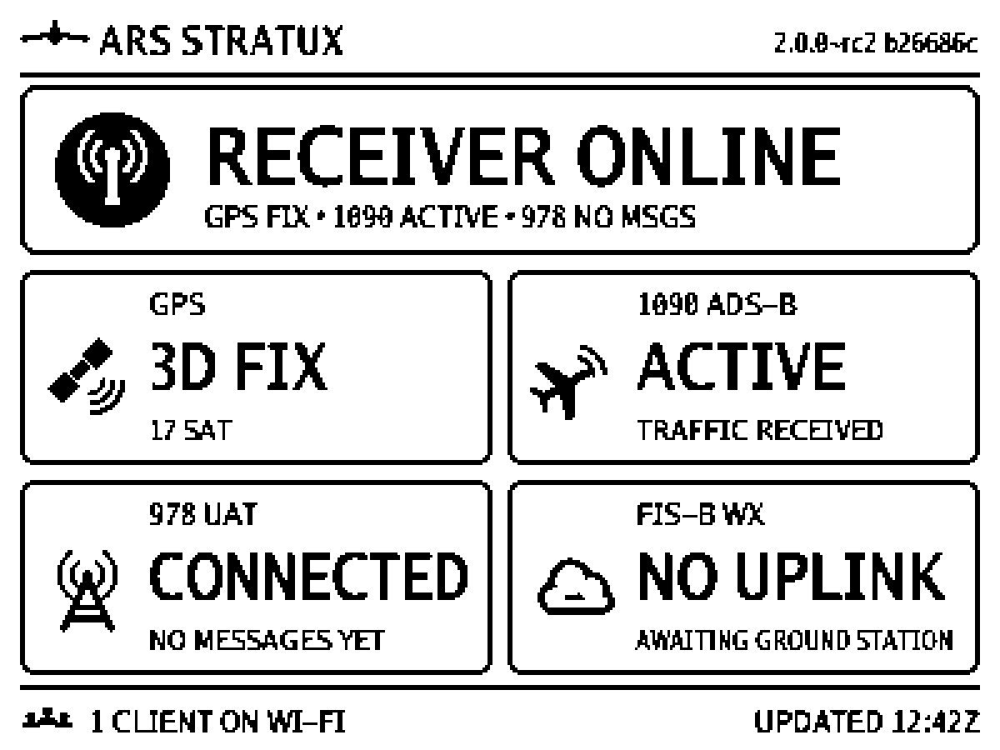

# E-paper operating dashboard (400 x 300)

> **A supplemental status surface, not a flight instrument.** This screen is
> not a certified display, not an annunciator, not a weather source and not a
> substitute for your EFB. Whether it is enabled, working, stale or absent has
> no effect on 978/1090 reception, GDL90 output, AHRS, GPS or anything else
> Stratux does. See the disclaimer in
> [waveshare-epaper-display.md](waveshare-epaper-display.md).

The dashboard is the normal operating screen for the Waveshare 4.2" V2 panel
(`waveshare-4.2in-v2`, 400 x 300, landscape). It answers, at a glance and
without a phone: *is the receiver up, do I have a GPS fix, is each radio
connected and hearing anything, is weather uplink arriving, and is anything
connected to it.*

*(Native 400 x 300 previews of every state are in
[img/epaper-dashboard/](img/epaper-dashboard/); the `@3x` files are the same
frames enlarged for reading.)*

## Design rules

1. **Derived, never canned.** Every word on the screen is chosen from live
   subsystem state. The banner's subtitle is built from the very tokens the
   tiles are built from, so it cannot say something a tile contradicts.
2. **Quiet is not broken.** No messages in a minute is `QUIET`, never a
   failure. A fault is only declared from hardware/decoder state (radio not
   detected, decoder not running, GPS receiver gone), never from silence.
3. **Never stale-but-live.** E-paper keeps its image, so the panel actively
   shows `NO STATUS DATA` (and every tile `UNKNOWN`) when current data cannot
   be confirmed, instead of leaving the last good frame up.
4. **One bit, no shading.** State is carried by words and glyphs (a fault
   `X`, a warning triangle, a `?`), a thicker border, and an inverted
   (white-on-black) banner for the two worst states. Nothing depends on grey.
5. **Truthful about what is unknown.** An unavailable client count reads
   `CLIENTS UNKNOWN`; an untrusted clock is never shown as a time of day.

## Screen layout

| Region | Content |
|---|---|
| Header | Brand mark, `ARS STRATUX`, the **running** version and short build from `/getStatus` (`2.0.0~rc2 b26686c`; `VERSION ?` until the first reading), and active device-health warnings as inverted chips (`! UNDERVOLT`, `! THROTTLED`, `! HOT 83C`, `! SVC FAIL`, `! DATA`), as many as fit |
| Banner | Overall state, large, with a state pictogram; subtitle derived from the tiles |
| Tiles (2 x 2) | GPS, 1090 ADS-B, 978 UAT, FIS-B WX: label, large state word, small detail line, pictogram, and a level glyph in the corner when not healthy |
| Footer | Connected-client count (left); `UPDATED hh:mmZ` or `UPDATED UP hh:mm` (right) |

Rendering is 1-bit and deterministic (`epaper_main/dashboard_*.go`): integer
geometry for rules and borders, 4x-supersampled vector pictograms, and the
BSD-licensed Go fonts (already part of `golang.org/x/image`; no new
dependency, no font file to ship) squeezed horizontally to give the condensed
look. Text is fitted to its box (squeeze, then shrink, then trim with `.`):
nothing is drawn clipped, and a test proves it for every state.

## Overall banner

| Banner | Meaning | Look |
|---|---|---|
| `RECEIVER ONLINE` | The Stratux service is up and answering with current data, no subsystem tile is failing or warning, and no device-health warning is active. **It does not mean GPS, both radios, FIS-B or any client is working** - the tiles and subtitle say what is. | broadcast pictogram |
| `STARTING` | The daemon's own uptime is under 90 s (or the display service is waiting for its first reading). Subsystems not up yet read `STARTING`, not failed - and a band that reads "disabled" during this period (the daemon has not evaluated its radios yet; seen for ~90 s on the bench) reads `STARTING` too. | hourglass |
| `RECEIVER DEGRADED` | Online, but something needs attention: GPS has no fix or only dead reckoning, a fix with fewer than 4 satellites, a status source unavailable, or an active power/thermal/service warning. | warning triangle, heavy border |
| `RECEIVER FAULT` | A receiver is missing or its decoder is not running (GPS receiver disconnected, 1090 or 978 radio not detected, SDR conflict/ambiguity). | inverted banner, `X` |
| `NO STATUS DATA` | Current data cannot be confirmed: `/getStatus` has been unreachable for more than 20 s, or it answers but its uptime has stopped advancing for 15 s (the daemon's status loop is wedged). Every tile is `UNKNOWN`. | inverted banner, `?` |

Subtitle tokens (in fixed order `GPS • 1090 • 978`): `GPS FIX`, `GPS FIX LOW`,
`NO GPS FIX`, `GPS DR ONLY`, `GPS OFFLINE`; `1090|978 ACTIVE`, `QUIET`,
`NO MSGS`, `DOWN`, `OFF`, `STARTING`.

## Tiles

**GPS** - from `GPS_solution`, `GPS_connected`, `GPS_satellites_locked/seen`.

| Headline / detail | When |
|---|---|
| `3D FIX` / `17 SAT` (`12 SAT SBAS`) | fix reported and at least 4 satellites in the solution. The count shown has hysteresis: it follows the real count only when it differs by 3 or more, or crosses 0 or the 4-satellite line, because the real count wanders by one or two every minute or so and each wobble would otherwise cost a panel refresh |
| `FIX` / `3 SAT • LOW` | a fix flag with fewer than 4 satellites (cannot be a 3D solution, so it is not called one) |
| `NO FIX` / `7 SAT SEEN` (hysteresis as above, without the 4-satellite line) or `SEARCHING` | receiver alive, no fix (a lost fix drops the tile within ~8 s: the daemon clears its fix within 3 s, plus one poll) |
| `DEAD RECK` / `NO SATELLITE FIX` | dead reckoning only |
| `NO GPS` / `DISCONNECTED` | receiver gone (fault) |

> **2D vs 3D.** Stratux derives its fix flag from the NMEA GGA quality field,
> which cannot distinguish a 2D from a 3D fix (the daemon itself labels quality 1
> "3D GPS"). The tile therefore shows `3D FIX` only with >= 4 satellites in the
> solution and never claims a dimension it cannot know.

**1090 ADS-B / 978 UAT** - *connected* and *receiving* are separate concepts.

| Headline / detail | When |
|---|---|
| `OFF` / `DISABLED IN SETTINGS` | band disabled |
| `NO RADIO` / `NOT DETECTED` | enabled, but no radio/SDR bound (or ambiguous/conflicted assignment) - fault |
| `NOT RUNNING` / `DECODER STOPPED` | SDR assigned but its decoder is not running - fault |
| `CONNECTED` / `NO MESSAGES YET` | hardware up, nothing received yet this run (the reference state for 978) |
| `ACTIVE` / `TRAFFIC RECEIVED` (`MESSAGES RECEIVED`) | a valid message in the last 60 s |
| `QUIET` / `LAST MSG <5 MIN AGO` or `NONE IN LAST MIN` | hardware up, nothing in the last minute - never a fault |

For 978 the **live** `UATRadio_connected` flag (external low-power UAT radio)
decides the hardware side; otherwise the SDR assignment/decoder fields do.

**FIS-B WX** - reports *reception by this unit's 978 radio*, and nothing more.

> **What this tile does not say.** A rising FIS-B product counter proves that
> uplink frames carrying weather-product IDs were decoded. It does **not**
> prove a populated rolling cache, weather that is fresh or usable, GDL90 0x07
> delivery to any client, or that ForeFlight (or any EFB) is displaying
> weather. No state on this screen says or implies "weather available" or
> "weather current"; the headlines describe what the radio did (`WX RX ...`),
> and a test guards the wording. Live FIS-B acceptance (populated cache,
> current products, 0x07 delivery, EFB weather) is a separate gate, PR #15's,
> and is not affected by this screen.

| Headline / detail | Meaning |
|---|---|
| `OFF` / `978 DISABLED` | 978 disabled |
| `NO RECEIVER` / `978 RADIO DOWN` | the 978 receiver is faulted (fault) |
| `NO UPLINK` / `AWAITING GROUND STATION` | no ground-station uplink seen (reference state) |
| `NO UPLINK` / `NONE IN LAST MIN` | towers have been heard earlier, none in the last minute |
| `UPLINK LOST` / `LAST <5 MIN AGO` | an uplink was seen this run and has been silent more than 2 min |
| `UPLINK` / `NO WX FRAMES YET` | ground station heard, no weather-product frame decoded yet |
| `UPLINK` or `NO UPLINK NOW` / `RX AGE UNKNOWN` | product frames were decoded before the display service began watching; when is unknowable, so no recency is claimed |
| `WX RX RECENT` / `LAST FRAME <2 MIN AGO` | a weather-product frame was decoded within the last 5 min |
| `WX RX AGING` / `LAST FRAME <15 MIN AGO` | newest such frame 5-15 min old |
| `WX RX STALE` / `LAST FRAME <30 MIN AGO` | newest such frame more than 15 min old (uplink still being heard does not change this) |
| `UNKNOWN` / `UPLINK STATUS ?` | tower data unavailable |

Frames are METAR, TAF (includes winds aloft), NEXRAD, SIGMET and PIREP product
counters; NOTAM and "Other" frames prove an uplink but not weather. The tile is
driven by *live* counter increases only - it never reads a cache, so it cannot
present cached weather - and the age is the age of the newest *frame*, not of
any weather (a rebroadcast METAR looks new).

## Footer

* **Clients**: `NO CLIENTS ON WI-FI`, `1 CLIENT ON WI-FI`,
  `N CLIENTS ON WI-FI`, or `CLIENTS UNKNOWN` when `/getClients` is
  unavailable: devices on the Stratux Wi-Fi that the daemon currently
  considers awake (mapping table below). This is network presence only - not
  that any of them is receiving GDL90, that an EFB is running, or that it shows
  anything - and the wording deliberately does not say "connected".
* **Update time**: `UPDATED 12:42Z` (UTC) **only** when `/getHealth` reports
  the clock trusted (`GNSS_SYNCED` / `NETWORK_SYNCED`); otherwise
  `UPDATED UP 01:04` (hours:minutes since Stratux started - the Pi has no
  battery-backed clock, so an unsynced wall clock is never shown). The time is
  stamped when the frame is composed, and is not itself a reason to refresh.

## Telemetry mapping and limitations

Only the daemon's existing, read-only JSON endpoints are used, over
`http://127.0.0.1`. Nothing is added to the daemon, nothing is written to the
aviation data path, and no simulated telemetry is ever sent to it (fixtures
exist only in the tests). Polled every 5 s, all endpoints concurrently, each
bounded to 2 s.

| Shown | Endpoint : field | Authority and limitation |
|---|---|---|
| Version / build | `/getStatus`: `Version`, `Build` | the running daemon's own; build shortened to 7 characters |
| Daemon alive | `/getStatus`: `Uptime` (ms) | advanced once a second by the daemon's status loop; a frozen value means a wedged loop |
| GPS state | `/getStatus`: `GPS_solution`, `GPS_connected`, `GPS_satellites_locked`, `_seen` | `GPS_solution` is recomputed every second and the fix flag is cleared 3 s after the last valid fix; no 2D/3D distinction (above) |
| 1090 hardware | `/getStatus`: `ES_Enabled/_Detected/_Assigned/_DecoderRunning/_Ambiguous/_Conflict` | SDR assignment state |
| 978 hardware | `/getStatus`: `UATRadio_connected` (live), else `UAT_Enabled/_Detected/_Assigned/_DecoderRunning/_Ambiguous/_Conflict` | `UAT_ExternallySatisfied` is assignment-time and deliberately not used |
| Band reception | `/getStatus`: `ES_/UAT_messages_total`, `_messages_last_minute` | totals count *valid decoded* messages (uplinks failing Reed-Solomon are dropped before counting); `UAT` includes traffic and uplinks alike; volatile (lost on daemon restart) |
| Uplink | `/getTowers`: entries with `Messages_last_minute > 0`; product counters | tower activity is a 60 s window over parsed uplinks; a single tower can flip to 0 during a brief fade (observed in the field) |
| Weather products | `/getStatus`: `UAT_METAR/TAF/NEXRAD/SIGMET/PIREP/NOTAM/OTHER_total` | **frame counters, not distinct products**: a rebroadcast counts again, NEXRAD counts frames, WINDS counts as TAF, and age is *reception* age, not the age of the weather (a rebroadcast METAR looks new). Only increases are used |
| Clients | `/getClients`: unique `Ip` among UDP connections whose `SleepFlag` is false | the daemon marks a connection asleep when its probe gets no answer for 10 s or an ICMP port-unreachable came back within 5 s (evaluated about once a second). Observed on the bench Pi: a laptop on the network with a UDP listener on 4000 had only its `:4000` connection awake (2000 and 49002 asleep) and counted as one client; with the listener stopped it went to zero within 2 s. So a client counts while something is actually listening on one of the daemon's GDL90 UDP ports - an EFB in the foreground. It still cannot say *which* app. A device that answers pings but has nothing listening (a laptop, a phone with the EFB closed) is flipped awake for ~5 s of every ~30 s by the daemon, so presence is judged over a **45 s hold**: a client counts until it has not been seen awake for 45 s. (Without the hold the footer, and so the panel, flapped 0 <-> 1 every 30 s on the bench: 22 material changes in the first five minutes of a boot, most of them this.) `Connected_Users` is **not** used - it counts every ping and pong seen in the last 15 minutes |
| Clock trust / CPU temp / failed units | `/getHealth`: `Time.State`, `System.CPUTempC`, `System.FailedServices` | as reported by readiness |
| Power | `/getPowerHealth`: `undervoltageNow`, `throttledNow` | *current*, debounced bits only. `/getHealth`'s `UndervoltageDetected`/`Throttled` are sticky "since boot" and are deliberately not used. The transient-undervoltage investigation is on hold; this only consumes the existing status |

The dashboard does not use the FIS-B diagnostic cache (PR #15, not part of
this build's display path), and has no access to GDL90 or to what any EFB
displays.

## Freshness thresholds

| Quantity | Threshold | Why |
|---|---|---|
| `/getStatus` unreachable | 20 s -> `NO STATUS DATA` | four missed 5 s polls |
| Daemon status loop frozen | 15 s of readings with no uptime advance -> `NO STATUS DATA` | the loop ticks at 1 Hz; 15 s is unambiguous |
| Secondary source unavailable | 30 s -> its data becomes unknown and a `! DATA` chip shows | a failed side endpoint must not declare the receiver failed |
| Client presence hold | 45 s since last seen awake | the daemon flaps a device that answers pings but has no app listening (awake ~5 s in ~30 s); a real departure still shows within a minute |
| Startup grace | 90 s of daemon uptime | radios and GPS legitimately take that long |
| Band `ACTIVE` | message in last 60 s | the daemon's own receiving window (`receivingFreshness`) |
| Uplink recent | 2 min | ground stations transmit about once a second; rides through a fade without flapping |
| Weather-frame reception `RECENT` / `AGING` / `STALE` | 5 / 15 min | FIS-B products repeat every ~5 min (METAR, radar, SIGMET) to ~10 min (TAF, winds, PIREP, NOTAM) |
| `HOT` warning | CPU >= 80 C | the Pi begins thermal throttling at 80 C |

Ages are shown as coarse bounds (`<2`, `<5`, `<15`, `<30`, `<1 HR`, `1 HR+`)
so a displayed age never forces a refresh by ticking; only crossing a bucket
does. All comparisons use a monotonic clock, so a wall-clock step (for example
the GPS time sync) cannot move any window.

## Refresh behavior

The panel is refreshed by `epaper.DecideDashboard` (pure, unit-tested), not by
polls. Following Waveshare's manual for this module (refresh no more often than
every 180 s in continuous use; a full refresh after several partial ones, its
FAQ says after 5; refresh at least every 24 h):

* the first frame is a **full** refresh;
* a **material change** (any visible word, glyph, count or warning - *not* the
  footer time) refreshes once the interval has passed, **coalesced**: changes
  arriving faster are folded into the next allowed refresh, which shows the
  state as it then is;
* the interval is `EpaperRefreshIntervalSeconds` (default 15) but **never
  below 30 s** on this screen;
* a **storm guard** spaces refreshes at 180 s after 10 refreshes in 10 minutes
  (a flapping input must not wear the panel) and releases once the window has
  drained to 2 or fewer. (Measured on the bench panel: a normal boot uses 5-6
  refreshes in its first four minutes, so a lower threshold engaged the guard
  on every boot and held real changes back for minutes.) A flip of the banner
  between normal and inverted (`RECEIVER FAULT` / `NO STATUS DATA` appearing
  **or clearing**) is exempt (never from the 30 s floor), at most 4 times per
  10 minutes: a screen that cannot be confirmed current - or that still shows
  an alarm that has passed - must not sit unchanged for up to 3 minutes.
  Otherwise a short-lived state can be coalesced away entirely (a 10 s daemon
  restart may never draw `STARTING`);
* a **proof-of-life partial refresh** every 10 minutes if nothing changed, so
  the footer time keeps proving the service is alive (6 per hour);
* at most **5 partial refreshes** between full ones (whatever
  `EpaperFullRefreshEvery` says), and a full refresh at least every 4 h;
* **every refresh is full while the banner is inverted** (`RECEIVER FAULT` /
  `NO STATUS DATA`), not only the flip into or out of it, **and is preceded by
  a Clear()** (a genuine blank, full-refresh baseline - the same step the
  driver already does at panel init/page-switch time, and the owner confirmed
  it redraws clean). Found on the bench in two rounds: (1) a content-only
  change while still inverted - the "NO DATA FOR ..." bucket advancing - was
  drawn as a *partial* refresh and left the whole screen visibly ghosted;
  marking every refresh full while inverted did not fully fix it - (2) even a
  *full* refresh straight onto existing panel content was not enough for the
  banner's large solid black fill (confirmed by owner re-test); a plain page
  switch (Init -> Clear -> draw) on the very same panel redrew clean, so every
  full refresh while inverted now reuses that same Clear-first sequence.
* refreshes never overlap (single goroutine; the poller runs separately and a
  hung request cannot delay a decision), and a failed panel update is reported
  in the service health and retried once per interval, not once per poll.

Boot splash, shutdown splash and the "Safe to remove power" screen are
unchanged; the dashboard's first frame is its `STARTING` screen.

## Failure and recovery matrix

| Event | Screen |
|---|---|
| Daemon restart | uptime/counters go backwards: all history dropped; `STARTING` until 90 s; weather from the old run is never shown |
| Status source down / wedged | `NO STATUS DATA` after 20 s / 15 s; recovers on the next good reading |
| One secondary source down | affected field unknown (`CLIENTS UNKNOWN`, FIS-B `UNKNOWN`), `! DATA` chip, banner `DEGRADED` |
| 978 radio unplugged / replugged | `NO RADIO` + FIS-B `NO RECEIVER` + `RECEIVER FAULT`; back to `CONNECTED` on reconnect |
| GPS fix lost / regained | `NO FIX` + `DEGRADED`; back to `3D FIX` |
| First 978 message | `CONNECTED / NO MESSAGES YET` -> `ACTIVE` |
| FIS-B arrives / stops | `UPLINK` -> `WX RX RECENT` -> `WX RX AGING` -> `WX RX STALE` |
| Client connects / disconnects | footer count changes (a material change) |
| Panel disconnected | `epaperd` reports `NOT_DETECTED` in its health as before; nothing else is affected |
| Renderer/poller bug | recovered per cycle; reported as an error category, never a crash |

## Selecting the dashboard

`EpaperPage` = `dashboard` (Settings > E-paper display > Page). It is the
default when no page is configured **on the 4.2" V2 panel**; other panels keep
`overview`. An installation that already has an explicit `EpaperPage`
(the Settings page saves `overview` when it is opened and saved) keeps it: select
`Operating dashboard` to switch. The layout targets landscape, so at rotation 90 or
270, or on the 3.7" panel, `epaperd` shows the legacy text pages instead.
Rotation 180 is supported (the frame is turned point-symmetrically).

## Deployment

1. Build the `.deb` from CI (arm64) for the PR, verify its SHA-256.
2. Install through the normal OTA path (`/updateUpload`); the display service
   restarts with the new `epaperd`.
3. Choose the page: Settings > E-paper display > `Operating dashboard`, or
   `POST /setSettings {"EpaperPage":"dashboard"}`.
4. Confirm: `/getHealth` -> `Epaper` shows `READY`, refresh counters advance.

## Tests

* `epaper/dashboard_derive_test.go` - state derivation and freshness
  transitions: the reference state, startup, GPS loss and recovery, 1090 quiet
  vs fault, 978 first message/quiet/disconnect/reconnect/SDR paths, FIS-B
  sequences (uplink, products, aging, stale, lost, unknown age, restart),
  source failure and recovery, frozen status loop, secondary-source failure,
  client count changes, warnings, footer time basis, clock steps.
* `epaper/dashboard_policy_test.go` - refresh decisions: change-only,
  coalescing, heartbeat, partial cap, full-refresh cadence and maximum age,
  banner inversion, interval floor, storm guard, retry hold-off.
* `epaper_main/dashboardsource_test.go` - parsing of **real payloads captured
  from the bench Pi** (`testdata/pi-payloads/`), failed/foreign/hung endpoints,
  the runner and its shutdown.
* `epaper_main/dashboard_refresh_test.go` - the refresh loop against a fake
  panel: first frame, no refresh for polls or the clock alone, heartbeat,
  coalescing, `NO DATA` and recovery, failure/retry, client changes, panic
  containment.
* `epaper_main/dashboard_render_test.go` - golden images of 12 states, one-bit
  output, no clipped or overlapping text, 180-degree symmetry, and that the
  previews under `docs/img/epaper-dashboard/` are current. Regenerate with
  `go test ./epaper_main -run TestDashboardGoldenImages -update` after checking
  the previews by eye.

Preview index: `01-startup`, `02-reference`, `03-fully-receiving`,
`04-no-gps-fix`, `05-978-disconnected`, `06-fisb-stale`,
`07-status-unavailable`, `08-health-warning`, `09-uplink-no-products`,
`10-clock-untrusted`, `11-1090-down-fault`, `12-worst-case-text`.

## Acceptance aids (read-only, isolated)

* `epaperd -preview-png FILE` shows a 400 x 300 PNG on the panel once and exits
  (Init -> Clear -> full refresh -> Sleep, then releases SPI/GPIO). It exists so an
  owner can review warning / degraded / fault / no-data frames that cannot be produced
  safely on a live unit: feed it the goldens in `epaper_main/testdata/dashboard/`.
  It touches only the panel - it reads nothing from and sends nothing to the Stratux
  daemon, GDL90 or any EFB - and, like `-splash`, refuses to run while the
  `stratux_epaper` service owns the panel (stop the service first, or pass
  `-splash-force`). Uses `-splash-panel` / `-splash-rotation` (0 or 180). Afterwards
  `systemctl start stratux_epaper` redraws the live dashboard from scratch.
* `EPAPER_LIVE_URL=http://192.168.10.1 go test ./epaper_main -run TestLiveDashboardFromDevice -v`
  renders what the panel should show from a real daemon's APIs (GETs only);
  `EPAPER_LIVE_WATCH=<seconds>` with `TestLiveWatchDashboard` logs each material change.

## Physical validation (bench Pi, 2026-09-27)

Bench unit: Raspberry Pi 4B, external 978 UAT radio, RTL-SDR 1090, u-blox GPS,
Waveshare 4.2" V2 panel (rotation 0). Every build below was installed through the
normal OTA path (`/updateUpload`) from its **PR CI arm64 artifact**, and the
installed `epaperd` was hashed and compared with the artifact's; `dpkg --audit`
clean each time. The bench Pi's explicit `EpaperPage` was switched from
`overview` to `dashboard` through `/setSettings` (the only device setting
changed; set it back to `overview` to revert).

**Observed by the owner (looking at the panel):** with build `eed8de4a` and again
with the final build `65ae00f9`, the frame matched the expected state
(`RECEIVER ONLINE` / GPS 3D FIX / 1090 ACTIVE / 978 CONNECTED, NO MESSAGES YET /
FIS-B NO UPLINK, AWAITING GROUND STATION), legible, nothing clipped, no visible
ghosting.

**Observed through the API and the display service's own status file (not by
eye):** refresh counters, timestamps, health and the derived state, below.
The panel *content* for these was not looked at by a person.

| Test (final build unless noted) | Result |
|---|---|
| Install / persistence | OTA verified; `EpaperPage` persisted across the OTA reboot; `dpkg --audit` clean |
| Client joins / leaves the network | join: refresh in 21-31 s (30 s floor); leave: refresh 54 s after the laptop left (45 s hold + poll) |
| Daemon outage (stopped 55 s) | `NO STATUS DATA` frame drawn 21 s after the stop (full refresh; health `STATUS_SOURCE_UNAVAILABLE`); recovery frame drawn 4 s after the daemon returned (health cleared) |
| Display service restart | `RUNNING`, first frame drawn, 8.7 MB RSS, ~1.6 % CPU, 9 threads, 0 busy timeouts |
| Boot | 1 full + 5 partial refreshes in the first ~5 minutes (6 material changes; 35 before the fixes below) |
| Regression | Overall/1090/978/GPS/AHRS/baro/GDL90/fan/system/storage all READY; 0 failed units; `get_throttled` 0x0; 0 kernel power lines; 0 busy-timeout lines; web UI and the new page option served |
| GDL90 (passive client) | full message mix (0x00 heartbeat 60/min, 0x0A, 0x0B, 0x14, 0x4C, 0x53, 0x65, 0xCC) at normal rates, same IDs as the pre-install baseline |

**Not validated on hardware (only by tests and previews):** the boot-splash ->
dashboard hand-over as seen by eye, the inverted `NO STATUS DATA` / `RECEIVER
FAULT` banners and every warning/degraded/fault look, GPS fix loss and recovery,
978 radio removal and reconnection, FIS-B states (there is no live uplink on the
bench: `NO UPLINK` is what the panel showed; the other states were exercised
with isolated fixtures only), long-run ghosting over many partial refreshes, and
the shutdown (power-off) screen, which needs the Pi to be switched back on and was
not run. No simulated telemetry was sent to the daemon, ForeFlight or any live data path.

**Defects the bench found and fixed** (each has a test that fails without the fix):

1. The storm guard engaged on every boot (6 refreshes in 10 minutes) and held real
   changes back for minutes: threshold raised to 10 in 10 minutes.
2. It could equally delay `NO STATUS DATA`: flips of the banner into or out of
   the inverted state are exempt (never from the 30 s floor), at most 4 per 10 minutes.
3. After a daemon restart (uptime falls to near zero) the "frozen status loop" check
   misread the first reading as frozen: any change of uptime now counts as life.
4. A configuration change that re-initialised the panel left the refresh policy
   believing the frame was drawn (blank panel until the next change).
5. The client count flapped 0 <-> 1 every ~30 s for any device that answers pings but
   has no app listening: presence has a 45 s hold.
6. The GPS satellite counts (used, and seen while searching) wandered every few
   seconds: hysteresis.
7. Both bands read "DISABLED IN SETTINGS" for ~90 s after a boot: that reads
   `STARTING` during the startup grace period.

**Environment notes.** One OTA attempt (of the second-to-last build) failed
and rolled back with `could not write disable marker: open
/overlay/robase/overlay/disable: read-only file system` (`overlayctl unlock`
reported success; the SD card showed no I/O errors, the Pi stayed on the previous
build); a retry of the identical package succeeded. That is the existing OTA
overlay-handling path, unrelated to this change, and was not investigated further.

## Known limitations

* The FIS-B tile is *reception* age from frame counters; the daemon exposes
  no per-product validity time. `WX RX RECENT` means "a weather-product frame
  was decoded recently" - not that any product is current, that a cache is
  populated, that GDL90 0x07 was delivered, or that an EFB shows weather.
* The client count is Wi-Fi presence: devices the daemon considers awake (something
  listening on a GDL90 UDP port, or answering probes without an unreachable reply, held
  for 45 s). It is not application identity and not GDL90 delivery, and it cannot see
  TCP/serial/BLE clients.
* 2D vs 3D fix is not distinguishable from the daemon's status.
* The Go fonts have a slashed zero; `1090` and `978` read with a slashed 0 on
  the panel. Deliberate and legible.
* Times the display service cannot know (weather issued before it started
  watching) are shown as unknown, not guessed.
* Only 400 x 300 landscape (rotation 0/180); other configurations use the
  legacy text pages.
